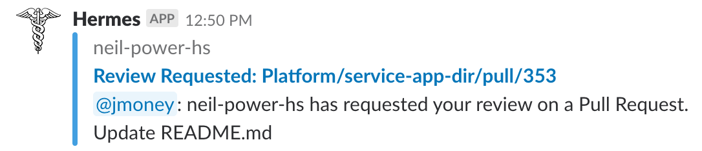
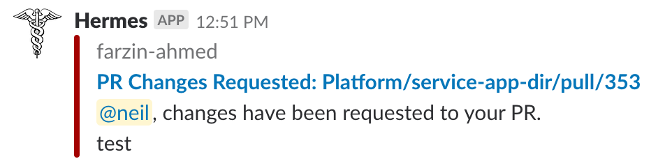
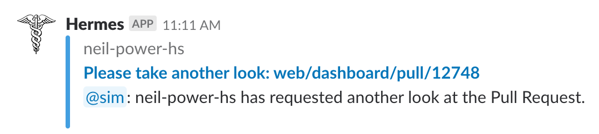
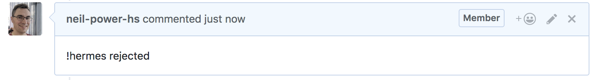
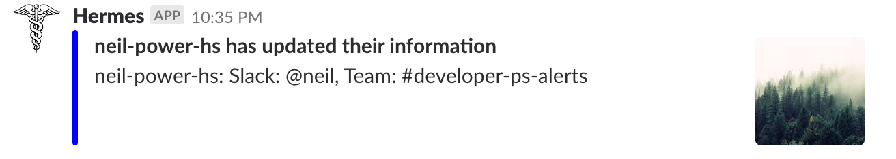

# Hermes

## Table of Contents ##
* [What is Hermes?](#TOC-WhatIsHermes)
* [Features](#TOC-Features)
* [Set Up a Hermes Server and Slack App](#TOC-Setup)
  * [Slack Setup](#TOC-SlackSetup)
  * [Running Hermes](#TOC-Running)
  * [Adding Github Webhooks](#TOC-Webhooks)  
* [Register Users/Teams](#TOC-Register)
  * [Register Teams]($TOC-Teams)
  * [Register Users]($TOC-Users)
* [Administering Hermes](#TOC-Administration)
* [Future Features](#TOC-Future)
* [License](#TOC-License)

## What is Hermes? ##

Hermes is a Kotlin ktor application which automates common Github/Slack workflows. Hermes is the namesake of the Greek messenger of the Gods, moving back and forth between Github and Slack so you don't have to.

With Hermes, you can severely reduce the amount of manual messaging between you and your teammates about your code in Github.

Currently Hermes:
* Notifies reviewers in slack when they are requested to review a Pull Request in Github.
* Notifies Pull Request authors when their Pull Requests have been reviewed (accepted, commented, or changes requested)
* Enables Pull Request authors to ping the reviewers of a Pull Request from Github, when the pull request has been updated.
* Pings a Pull Request author when one of their commits fails to build.

## Features ##

#### Notify Reviewers of a New Pull Request

Whenever you add reviewers to a Repo which is monitored by Hermes, Hermes users will get notified in their registered team channel that you would like them to look at your Pull Request.

#### Notify Pull Request Authors when a Review has been Submitted

Whenever a Pull Request reviewer submits a review, the PR author will get a Hermes message with the status of the review.

#### Notify Pull Request Authors when their commit has failed to build

Whenever a status check fails, the PR author will get a Hermes message letting them know that the check failed with a link to the check.

#### Ask Reviewers to take another look at a Pull Request

After a PR author has made requested changes to a Pull request, or if they want to ask a reviewer to look again after time has passed, an author can comment on the Pull Request with various control comments.

`!hermes` will send a message to each of the reviewers asking them to take another look
`!hermes @user` will send a message to that particular user asking them to take another look
`!hermes unapproved` will send a message to any reviewer who has not approved the Pull Request.
`!hermes rejected` will send a message to the reviewers who have previously rejected the Pull Request.

The message in slack is:

An example of the comment is:

#### Send status messages to a Hermes admin channel in Slack

Various messages are sent to Hermes admin channel:
* When a Team / User is registered (both successfully and unsuccessfully)
* When a user is tagged in a Pull Request but is not registered with Hermes.
* When a user updates their information (to add an avatar for example)
* When a webhook is added to a repo or org in github (both successfully and unsuccessfully)

For example:

#### Allow the User to control Hermes in Slack

Hermes users can use the `/hermes` command in Slack to register or update their information. Currently, the supported commands are:
* `/hermes register <github-name>` to register to the channel the user is currently in
* `/hermes avatar <avatar-url>` to add or update their Hermes avatar
* `/hermes reviews` to show the reviews they are currently requested to take a look at 

## Set Up Hermes ##

Hermes is fully Open Source, written in Kotlin, using [ktor](https://ktor.io/). The ktor application powers a Slack app. Currently, Hermes is not distributed in the Slack App Store. If you would like to install Hermes to your Slack workspace, you will have to create a slack app.

These instructions are likely to change as the method of distributing Hermes is improved. If you would like to be an early adopter, follow the instructions below. We are happy to answer any questions you might have, just file an issue.

### Slack Setup

TODO - Detailed instructions on how to create a version of the slack app for your workspace.

### Running Hermes

Hermes uses ktor and is built with gradle.

Hermes requires some configuration files in order to connect to your Slack App.

TODO - Configuration File Examples

After setting up the configuration files, you can run the code by navingating to the `backend` directory and typing `../gradlew run` into the console.

This will start the ktor application on the port you configured in the step above. To ensure that Hermes is running, you can navigate to `localhost:8080`

The first time that you run Hermes, a database will be created and configured. Hermes uses Jetbrains' [Exposed](https://github.com/JetBrains/Exposed) library to manage its database.

When Hermes is running, it will send status messages to the Slack Channel that you configured in the above step.

You're now ready to add some Github Webhooks for Hermes to monitor.

### Adding Webhooks

In order to add Github webhooks, you will need to be able contact the server that Hermes is running on. For testing you can use [ngrok](https://ngrok.com/) to open the relevant port. In the future, I will distribute an AWS AMI with which you can run Hermes. You can then use the server's address.

Under the `Settings` section of a Github org or repo which you wish to monitor, navigate to the `Hooks` section to add a webhook. 

The payload URL is the URL pointing to your Hermes server with `/webhook` added. 

The content type is `application/json`.

Currently, there is no shared secret, though this will be added in the future.

Select `Let me select individual events` and choose: `Issue Comment`, `Pull Request`, `Pull Request Review`, and `Status`.

You will get a message in the Hermes admin channel you chose above telling you if you have configured the webhook correctly, or if you have extra, or missing events.

Now that you are monitoring one or more repos, you're ready to add some users to Hermes in slack!

## Register Users/Teams ##

Hermes uses two data structures for routing github events to slack: `Users` and `Teams`.

A team is a Slack Channel where Hermes messages are sent. Each team has one or more users. 

A user is a binding of a Github username to a Slack handle and a Hermes team. A user registers a Slack handle to a particular team where messages targeted at them will be sent.

Currently, the options to register users and teams can be done on a static frontend and through Slack.

One of the upcoming features of Hermes is a React frontend, built with the [kotlin-frontend-plugin](https://github.com/Kotlin/kotlin-frontend-plugin). For now, the static html can be used.

### Register Teams ##

Registering a team requires authenticating with your slack workspace. In the [Slack Setup](#TOC-SlackSetup) step above, a "Add to Slack" button is configured for your workspace. 

The button can be found at the `/install.html` path of your Hermes server. When you click the button, you will be prompted to choose a channel to connect the Hermes application to. This channel (or private message) is the team name.

Now that you have configured a team, you can add users to the team.

### Register Users ##

There are currently two ways to register a User to Hermes. In the future, the React frontend with the [kotlin-frontend-plugin](https://github.com/Kotlin/kotlin-frontend-plugin) will be used to register users. For now, you can use the static html page.

You can add a user by filling out the form on the `/registerUser.html` path. 

A user enters their Github name, Slack handle, Team name (configured in the previous step), and optionally an Avatar URL.

The other way to register a user is in Slack itself.

While in the channel that was configured in the previous step, a user can register to that team by using a Slack slash command.

Enter `/hermes register <github-name>` in the channel (with your Github name). A status message as well as a response to the slack command will be sent to slack.

Now that you have users registered, you are ready to use Hermes! Check out the [Features](#TOC-Features) section to see what you can do!

## Administering Hermes ##

TODO

## Future Features ##

These are some features which are planned to be added to Hermes. Please feel free to make a feature request by adding a Issue to this repo.
* Track the mean time to resolution for pull requests.
* Better front-end interface for registering users (React frontend with the [kotlin-frontend-plugin](https://github.com/Kotlin/kotlin-frontend-plugin))
* Allow the user to toggle on or off notifications
* Remove Teams and Users through the frontend
* Tests!
* Messaging the user who configured a webhook if possible when the webhook is misconfigured.
* Subscribe to specific hermes events.
* Control your hermes subscription through slack.
* Change formatting of messages to be more compact

## License ##

License
Copyright 2017 Hootsuite (developer.products@hootsuite.com)

Licensed under the Apache License, Version 2.0 (the "License"); you may not use this file except in compliance with the License. You may obtain a copy of the License at

http://www.apache.org/licenses/LICENSE-2.0
Unless required by applicable law or agreed to in writing, software distributed under the License is distributed on an "AS IS" BASIS, WITHOUT WARRANTIES OR CONDITIONS OF ANY KIND, either express or implied. See the License for the specific language governing permissions and limitations under the License.
